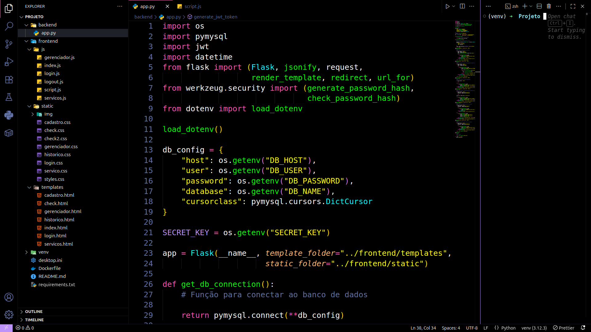

# 🖤 Midnight Black  

Midnight Black is a pure dark theme for VS Code featuring true black background and vibrant syntax highlighting designed for extended coding sessions without eye strain.  

  

---  

## 🎯 Key Features  

✅ Absolute black background for maximum contrast  
✅ Carefully curated vibrant syntax colors  
✅ Consistent visual styling across all languages  
✅ Distraction-free coding experience  

---  

## 🚀 Installation  

1️⃣ Open VS Code  
2️⃣ Go to Extensions (Ctrl+Shift+X / Cmd+Shift+X)  
3️⃣ Search for "Midnight Black"  
4️⃣ Click Install  
5️⃣ Activate the theme via:  
   - Ctrl+K Ctrl+T (Windows/Linux)  
   - Cmd+K Cmd+T (Mac)  
   - Select "Midnight Black"  

---  

## 💡 Why Choose Midnight Black?  

🌑 Perfect for developers who love true dark themes  
🩻 Scientifically designed to reduce eye fatigue  
🎨 Optimized color palette for code clarity  
⚡ Lightweight and performance-focused  

---  

## 📚 References  

- [VS Code Theme Documentation](https://code.visualstudio.com/api/extension-guides/color-theme)  
- [Color Contrast Guidelines](https://www.w3.org/WAI/WCAG21/Understanding/contrast-minimum.html)  

---  

> Transform your VS Code into an elegant, focused coding environment today.  

---  

Enjoy coding with 🖤 Midnight Black!  